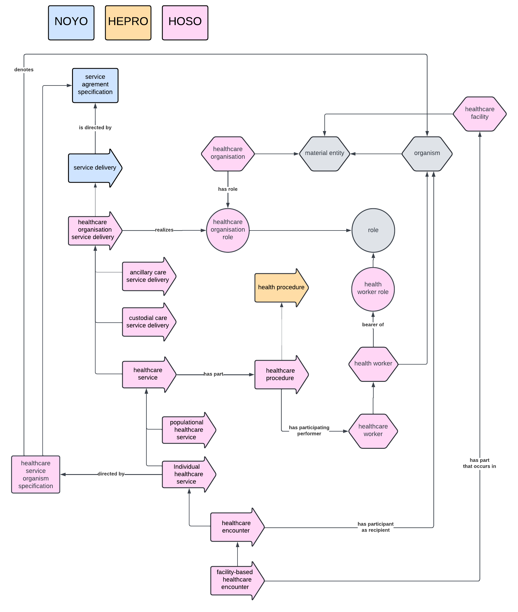

# HOSO Ontology Documentation

[//]: # "This file is meant to be edited by the ontology maintainer."

Welcome to the HOSO documentation!

You can find descriptions of the standard ontology engineering workflows [here](odk-workflows/index.md).

## Schema

## Classes

|IRI         |value                                                            |def                                                                                                                                                                                                                                                          |
|------------|-----------------------------------------------------------------|-------------------------------------------------------------------------------------------------------------------------------------------------------------------------------------------------------------------------------------------------------------|
|HOSO_0000003|healthcare service organism specification                        |A service agreement specification identifying an organism for whom a healthcare service delivery aims at providing a desired effect to its health status.                                                                                                    |
|HOSO_0000004|healthcare facility                                              |TBD                                                                                                                                                                                                                                                          |
|HOSO_0000005|health provider role - HEPRO                                     |A role that inheres in an organism as a consequence of training in order to be able to participate as a performer in some health activities.                                                                                                                 |
|HOSO_0000006|healthcare organization role                                     |A role that inheres in an organisation and is realized by providing some healthcare service delivery.                                                                                                                                                        |
|HOSO_0000007|health provider - HEPRO                                          |An organism that is the bearer of a health provider role.                                                                                                                                                                                                    |
|HOSO_0000008|healthcare organization                                          |An organisation that bears a healthcare organisation role.                                                                                                                                                                                                   |
|HOSO_0000009|healthcare provider                                              |A health provider who is a member of a healthcare organisation.                                                                                                                                                                                              |
|HOSO_0000010|healthcare procedure                                             |A health procedure that is part of a healthcare service delivery and that is performed by a healthcare worker while realizing its health care worker role.                                                                                                   |
|HOSO_0000011|healthcare organization service delivery                         |A service delivery under the responsibility of a healthcare organisation. It stems from an agreement between a requesting agent and a healthcare organization.                                                                                               |
|HOSO_0000012|healthcare organization clinical visit                           |A healthcare organisation service delivery that aims at providing a desired effect on the health status of a specified organism. It is usually composed of health procedures and possibly associated ancillary processes.                                    |
|HOSO_0000013|ancillary care service delivery                                  |A service delivery that aims to support health services without directly providing a desired effect on the health status of individuals or communities.                                                                                                      |
|HOSO_0000014|custodial care service delivery                                  |A service delivery from an organization that aims to provide for the activities of daily living of individuals or communities.                                                                                                                               |
|HOSO_0000016|populational healthcare service                                  |A healthcare service that aims at providing a desired effect on the health status of a community.                                                                                                                                                            |
|HOSO_0000017|healthcare organization clinical encounter                       |A temporally-connected healthcare organization clinical visit that aims to improve, maintain or restore the health of some participating organism.                                                                                                           |
|HOSO_0000018|facility-supported healthcare encounter                          |A healthcare encounter during which the recipient is located in a healthcare facility at some time.                                                                                                                                                          |
|HOSO_0000019|public provincial health identifier                              |An identifier that denotes a public provincial health insurance record.                                                                                                                                                                                      |
|HOSO_0000020|health provider identifier - HEPRO                               |An individual identifier that denotes a health provider.                                                                                                                                                                                                     |
|HOSO_0000021|physician identifier - HEPRO                                     |A health provider identifier that is used to denote a person authorised to act as a physician.                                                                                                                                                               |
|HOSO_0000022|healthcare facility identifier                                   |An identifier that denotes a building administered by a healthcare organization for the purpose of providing healthcare to a patient or patient population.                                                                                                  |
|HOSO_0000023|healthcare organization identifier                               |An identifier that denotes a healthcare organization.                                                                                                                                                                                                        |
|HOSO_0000026|outpatient visit                                                 |A healthcare organisation clinical visit where the patient physically attends to a healthcare facility, but where there is no expectation of providing support for activities of daily living (such as eating and bathing) nor accommodation for the patient.|
|HOSO_0000028|inpatient visit                                                  |A healthcare organisation clinical visit where there is expectation of providing support for activities of daily living (such as eating and bathing) and accommodation for the patient.                                                                      |
|HOSO_0000029|day inpatient visit                                              |An inpatient visit that does not extend overnight.                                                                                                                                                                                                           |
|HOSO_0000030|day inpatient surgery visit                                      |A day inpatient visit which includes a surgical procedure.                                                                                                                                                                                                   |
|HOSO_0000031|hospitalization                                                  |An inpatient visit located in a hospital facility requested by a physician, that may extends overnight.                                                                                                                                                      |
|HOSO_0000032|emergency department visit                                       |A healthcare organisation clinical visit where there is expectation of providing unplanned, timely, urgent care, including handling life-threatening conditions. It is not necessarily an immediate inpatient subsequent visit.                              |
|HOSO_0000033|emergency department inpatient visit                             |An emergency department visit and an inpatient visit, where there is usually limited accommodation and where the goal is to stabilise a life-threatening condition or decide whether the clinical situation requires a hospitalisation visit.                |
|HOSO_0000034|emergency department outpatient visit                            |An emergency department visit and an outpatient visit.                                                                                                                                                                                                       |
|HOSO_0000035|walk-in clinic visit                                             |an outpatient visit where there is expectation of providing unplanned, timely care, but excluding handling life-threatening conditions                                                                                                                       |
|HOSO_0000036|outpatient surgery visit                                         |an outpatient visit which includes a surgical procedure                                                                                                                                                                                                      |
|HOSO_0000037|outpatient diagnostic visit                                      |an outpatient visit which includes a diagnostic procedure                                                                                                                                                                                                    |
|HOSO_0000038|Immediate inpatient subsequent visit                             |An immediate subsequent visit healthcare organisation visit for a given patient that was participating in another healthcare organisation visit for the same organisation just prior to this visit.                                                          |
|HOSO_0000039|prior visit category to an inpatient visit                       |An information content entity describing the type of visit that occured prior to an immediate inpatient subsequent visit.                                                                                                                                    |
|HOSO_0000040|still born healthcare service                                    |A healthcare organisation visit where the main entity of interest is a still born.                                                                                                                                                                           |
|HOSO_0000041|healthcare birth visit                                           |A healthcare organization clinical visit during which a birth statement was produced regarding the birth of the main patient visit beneficiary.                                                                                                              |
|HOSO_0000042|inpatient visit from an external location                        |an inpatient visit that is not immedately following another healthcare organisation clinical visit in the same organisation, and is not a healthcare birth visit                                                                                             |
|HOSO_0000043|ambulance initiated emergency department visit                   |An emergency department visit for a given patient that was participating in another healthcare organisation visit involving paramedics just prior to this visit.                                                                                             |
|HOSO_0000044|cadaver service                                                  |A healthcare organization service delivery where the main entity of interest is a human cadaver that was not delivered just prior to this service.                                                                                                           |
|HOSO_0000045|healthcare visit of expiration                                   |A healthcare organization clinical visit during which a death statement was produced regarding the death of the main patient visit beneficiary.                                                                                                              |
|HOSO_0000046|visit discharge specification                                    |A directive information entity that aims at directing what health procedures or healthcare organization services are recommended after this visit.                                                                                                           |
|HOSO_0000047|visit transfer specification                                     |A visit discharge specification that aims at directing to which healthcare organisation the patient should be transferred after the end of the current visit.                                                                                                |
|HOSO_0000048|visit transfer specification category                            |An information content entity that is part of a visit transfer specification and is about the type of healthcare organization specified.                                                                                                                     |
|HOSO_0000049|visit discharge specification for home                           |A visit discharge specification for a given clinical visit that has no visit transfer specification.                                                                                                                                                         |
|HOSO_0000050|visit ended by the patient                                       |A healthcare organization clinical visit ended at the initiative of the patient without physician approval.                                                                                                                                                  |
|HOSO_0000051|visit ended by the patient without notification                  |A visit ended by the patient without notifying the healthcare organization.                                                                                                                                                                                  |
|HOSO_0000052|triage-only emergency department visit                           |An emergency department visit with a triage encounter but no further encounter.                                                                                                                                                                              |
|HOSO_0000053|emergency department visit with partial treatment                |An emergency department visit and a visit ended by the patient and some treatment healthcare procedure was provided.                                                                                                                                         |
|HOSO_0000054|visit diagnosis related group code                               |An identifier that denotes a diagnosis related group.                                                                                                                                                                                                        |
|HOSO_0000055|Healthcare organization clinical visit start charaterisation     |A temporal characterisation that is about the start of a healthcare organisation clinical visit                                                                                                                                                              |
|HOSO_0000056|Healthcare organization clinical visit finish charaterisation    |A temporal characterisation that is about the finish of a healthcare organisation clinical visit                                                                                                                                                             |
|HOSO_0000060|public provincial health insurance record                        |                                                                                                                                                                                                                                                             |
|HOSO_0000061|primary health insurance beneficiary human role                  |A role that is borne by an human that is the primary beneficiary of a health insurance plan and so is responsible for its associated contract.                                                                                                               |
|HOSO_0000062|primary health insurance beneficiary human                       |A human that has a role of primary health insurance benificiary role                                                                                                                                                                                         |
|HOSO_0000063|public provincial health insurance primary residence statement   |                                                                                                                                                                                                                                                             |
|HOSO_0000067|provincial health insurance primary residence statement beginning|                                                                                                                                                                                                                                                             |
|HOSO_0000068|immediate subsequent visit                                       |                                                                                                                                                                                                                                                             |
|HOSO_0000069|immediate subsequent visit in same organization                  |An immediate subsequent visit where both visits are under the responsability of the same healthcare organisation.                                                                                                                                            |
|HOSO_0000125|clinical visit ending determination                              |A healthcare procedure where the responsible healthcare worker comes to the conclusion that a clinical visit can end.                                                                                                                                        |
|HOSO_0000137|human clinical visit specified patient                           |                                                                                                                                                                                                                                                             |
|HOSO_0000138|healthcare provider identifier                                   |An identifier that denotes a healthcare provider.                                                                                                                                                                                                            |
|HOSO_0000139|facility-supported clinical visit                                |                                                                                                                                                                                                                                                             |
|HOSO_0000140|facility address                                                 |A postal address that enables an agent to locate a facility.                                                                                                                                                                                                 |
|HOSO_0000142|canadian facility address                                        |                                                                                                                                                                                                                                                             |
|HOSO_0000145|diagnosis related group                                          |                                                                                                                                                                                                                                                             |

## Properties

|IRI         |value                      |def|
|------------|---------------------------|---|
|HOSO_0000001|has participating performer|TBD|
|HOSO_0000002|has participating recipient|TBD|
